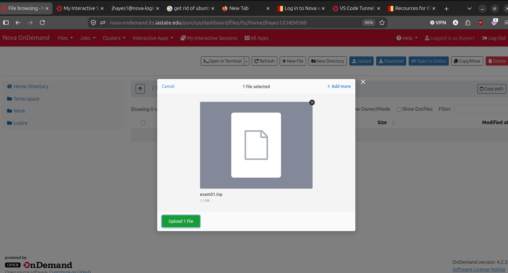
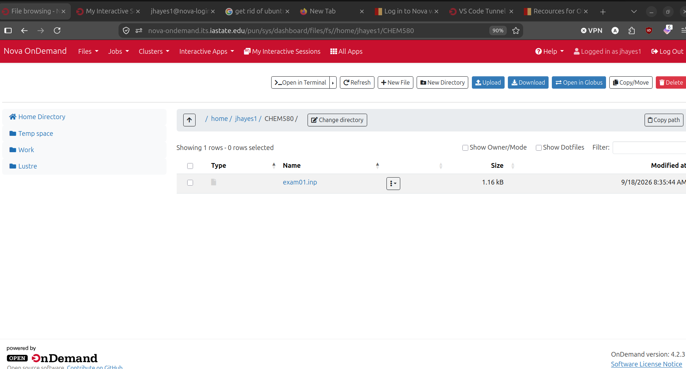

# Using GAMESS on NOVA

## Introduction

Nova is the Iowa State University high-performance computing cluster. It provides computational resources for running intensive scientific calculations, including quantum chemistry simulations with GAMESS.

This guide assumes basic Linux Terminal knowledge as well as concepts related to SSH (Secure Shell).

**Goal**

The goal of this tutorial is for you to be able to run a GAMESS calculation on Nova on an interactive session using the instruction partition all CHEM-580 students have access to.

## Accessing NOVA

You must be on the Iowa State University network or connected via VPN to access NOVA. 

There are several ways to access NOVA 

### Web "On Demand"

**Web Terminal**

There is a web interface for accessing a web based Linux terminal. This is accessed at https://nova-ondemand.its.iastate.edu/pun/sys/shell/ssh/nova.its.iastate.edu

**File Dashboard** 
There is a web interface for managing and accessing your files on NOVA. This is accessed at:
https://nova-ondemand.its.iastate.edu/pun/sys/dashboard/files/fs/home/jhayes1

### SSH Access

You can also access NOVA via SSH from a terminal on your local machine. Use the following command:

```bash
ssh your_username@nova.its.iastate.edu
```

Replace `your_username` with your Iowa State University NetID.

You will be prompted for a 2FA (Two-Factor Authentication) code then your ISU NetID password.

Detailed instructions for SSH access can be found at: https://nova.its.iastate.edu/ssh-access

https://research.it.iastate.edu/login-nova-ssh-client

## Starting an Interactive Session

An interactive session allows you to work directly on a compute node, which is useful for testing, debugging, and running GAMESS calculations. To start an interactive job on the instruction partition, follow these steps:

### Step 1: Check Your Account Associations

First, verify which accounts and partitions you have access to:

```bash
sacctmgr show associations user=$USER
```

This will display your available accounts and partitions. For CHEM-580 students, you should have access to the `instruction` partition.

You can also check the format with account and QOS information:

```bash
sacctmgr show user $USER withassoc format=account%30,partition%20,qos%30 -n
```

### Step 2: Check Available Partitions

View which partitions are available and their status:

```bash
sinfo -p instruction
```

This shows you the state of nodes in the instruction partition.

### Step 3: Allocate Interactive Resources

Use `salloc` to allocate resources for an interactive session. For the instruction partition with CHEM-580, use:

```bash
salloc -p instruction -A f2026.chem.5800.02
```

**Explanation of options:**
- `-p instruction`: Request the instruction partition
- `-A f2026.chem.5800.02`: Use the CHEM-580 class account


**Note:**: For your projects you may need to request more resources (Nodes, cores, etc.) this will be addressed this in another tutorial. 
 
### Step 4: Verify Your Interactive Session

Once the allocation is granted, you can verify you're on a compute node and check available modules:

```bash
pwd                    # Check your current directory
squeue -u $USER        # List your running jobs
module list            # Check loaded modules
```


### Step 6: Test Your Environment

Test your interactive environment with a simple command:

```bash
which python
echo "hello world" > hello_world.txt
cat hello_world.txt
```


### Step 5: Load GAMESS Module

Load the GAMESS module for your calculations:

```bash
module load gamess/31JUL2022R1
```

## Running a GAMESS Calculation

### Step 1: Prepare Input Files

Ensure your GAMESS input files are ready in your working directory. A typical input file has the extension `.inp`.

The easiest method for doing this now is to create your input and copy it to your working directory using the web file interface. 

https://nova-ondemand.its.iastate.edu/pun/sys/dashboard/files/fs/home/YOURNETID






### Step 2: Validate Input File Exists 

```bash
ls *
```
Expected Output: 
[jhayes1@nova21-swift-2 CHEM580]$ ls
exam01.inp


### Step 3: Run GAMESS

Submit your GAMESS job using the `rungms` command:

```bash
rungms exam01.inp &> exam01.log
```

<sub>

- `rungms` — GAMESS execution script 
- `exam01.inp &> exam01.log` — Runs input file and saves all output/errors to log file
- Results saved in `exam01.log` for review
- `&>` forwards all output to the specified log file.

</sub>

**NOTE**: This is different than the instructions which may have been given in the lecture slides. The gms run script shown in lecture is different than the one availible in Nova rungms. 


## Cleanup steps

### Exit the Interactive Session

When finished, exit the interactive session:

```bash
exit
```